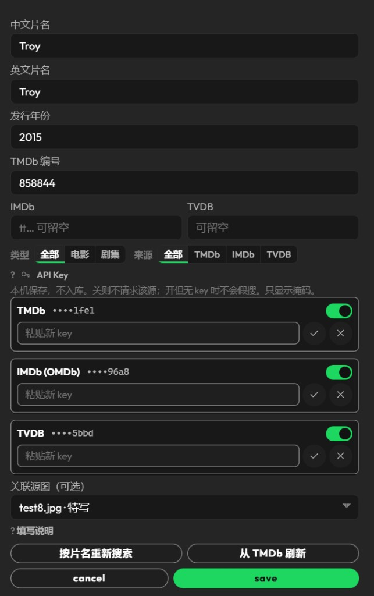
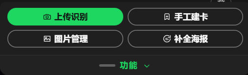
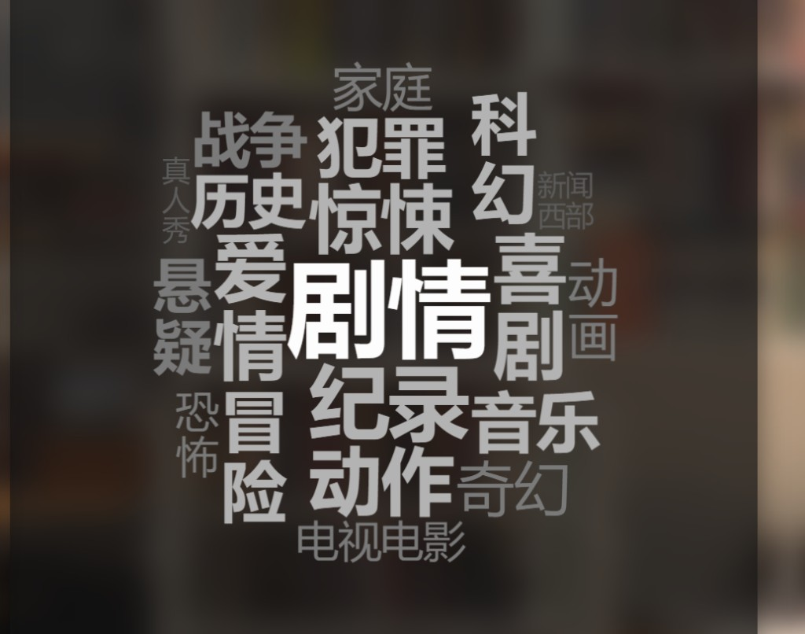

# myWall

个人蓝光 / DVD 收藏墙：拍一面碟墙，识别碟脊，匹配 **TMDb / OMDb(IMDb) / TheTVDB** 元数据，在浏览器里浏览和编辑。

当前版本：**v4.0**（中文单语言定稿）

## 语言与路线图

- **当前发布：** UI、使用手册与说明文案均为中文（碟片名、发行商等可夹杂英文，这是内容本身，不是界面语言）。
- **下一版：** 国际化，至少支持中 / 英界面切换。本版**不包含** i18n 工程，请勿在 v4.0 上直接改多语言。

## 本地运行

需要 Python 3.10+。

```powershell
python -m venv .venv
.\.venv\Scripts\activate
pip install -r requirements.txt
python app.py
```

浏览器打开 [http://127.0.0.1:5000](http://127.0.0.1:5000)。

服务默认监听 `0.0.0.0:5000`。电脑已加入 Tailscale 时，手机可用这台机器的 Tailscale 主机名（MagicDNS）加 `:5000` 访问，无需公网端口。

站内完整说明：`/static/docs/manual.html`。

## 配置 API Key

三个来源都可选：缺哪个，对应搜索就会在界面里禁用。

| 来源 | 用途 | 申请 |
| --- | --- | --- |
| TMDb | 海报、影片 / 剧集元数据 | [themoviedb.org/settings/api](https://www.themoviedb.org/settings/api) |
| OMDb（IMDb） | IMDb 片名搜索 | [omdbapi.com/apikey.aspx](https://www.omdbapi.com/apikey.aspx) |
| TheTVDB | 剧集元数据 | [thetvdb.com/api-information](https://thetvdb.com/api-information) |

**推荐：** 打开「编辑碟片」或「手工建卡」弹窗，在 **API Key** 区块填写。写入本机 `data/api_keys.json`（已 gitignore，热读、不必重启）。

也可以用环境变量（仅当 json 未覆盖时生效），见 `.env.example`：

```
TMDB_API_KEY=
TMDB_ACCESS_TOKEN=
OMDB_API_KEY=
TVDB_API_KEY=
```

不要把真实 key、`.env` 或 `data/api_keys.json` 提交进仓库。访问 TMDb 若需代理，可设 `HTTPS_PROXY` / `HTTP_PROXY` / `MYWALL_HTTP_PROXY`。

## 本地视觉模型（Stage2 / 自动识别，可选）

自动识别碟脊依赖本机或局域网上的 **LM Studio OpenAI-compatible** 服务，不是云端视觉 API。

1. 安装 [LM Studio](https://lmstudio.ai/)，下载视觉模型（默认 id：`zai-org/glm-4.6v-flash`）。
2. 开启 LM Studio 的 Local Server（OpenAI 兼容，常见端口 `1234`）。
3. 在 `config.py` 或环境变量填写：
   - `LMSTUDIO_BASE`：可配置的 endpoint，例如 `http://127.0.0.1:1234`。模型若跑在另一台机器，改成那台的 `http://主机:端口`。
   - `VISION_MODEL`：已加载的模型 id；`VISION_MODEL_AUTO=1` 时按偏好表在已加载模型里挑选。
4. 跑 Flask 的机器必须能访问该 endpoint（同机 / 同网段 / 防火墙放行）。
5. 若开了系统 Tun 或全局代理，局域网访问 LM Studio 可能被劫持：把内网段加入旁路，或只让出站 API 域名走代理。

**没有模型时，Stage2 / 上传自动识别不可用。** 用下面的手工建墙即可。

## 手工建墙（无模型主路径）

没有本地视觉模型，也能靠手工建卡 + 三平台搜索把墙建起来：

1. 点版本号旁的锁，进入可编辑。
2. 侧栏「功能」→ **上传识别**：上传碟脊特写（可先不跑识别）。
3. 打开碟脊框编辑，手工改框。
4. 可选 Stage2；模型不可用就跳过。
5. 「功能」→ **手工建卡**。
6. 填中 / 英片名，按片名搜 TMDb · OMDb · TVDB，点选候选补海报与编号。
7. 在详情里把特写框放到全景墙上（墙面放置）。
8. 手机只读浏览；按住卡片看 AR 定位。

## 截图

以下为作者本机 v4.0 界面。第一张含真实家居与碟墙，**仅用于本私有库说明；请勿把私人墙图用于演示 fork**。


桌面首页：左列表、中墙面（AR 半透明块叠在作者自己的收藏墙上）、右详情。



编辑碟片：TMDb / OMDb(IMDb) / TVDB 三行 key 只显示掩码末四位，可开关是否调用。



「功能」托盘：上传识别、手工建卡、图片管理、补全海报——手工建墙的主入口。



热词筛选图例：字号按碟数加权，点词即筛选。

## 不会进仓库的内容

个人碟库、墙面原片、上传图、识别产物和密钥默认被 `.gitignore` 排除：

- `data/api_keys.json`、`.env`
- `data/mywall.db`
- `photos/`、`uploads/`
- `out_b_stage1_*`、`data/spine_results/` 等识别输出
