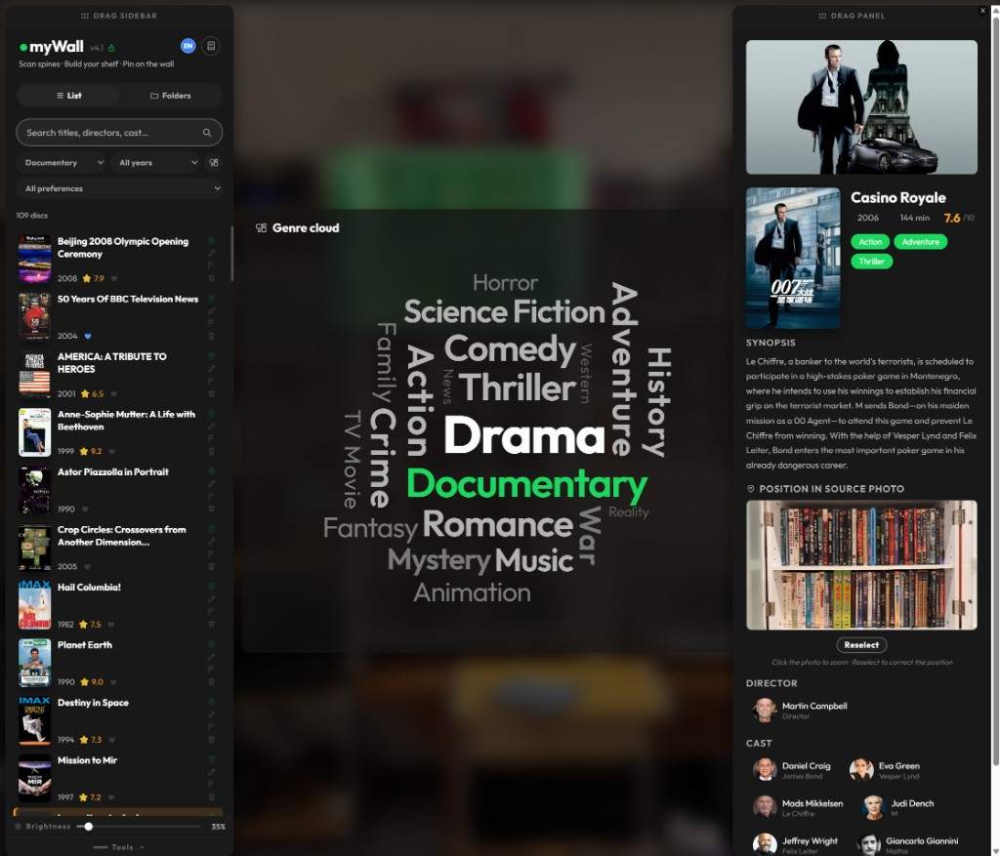
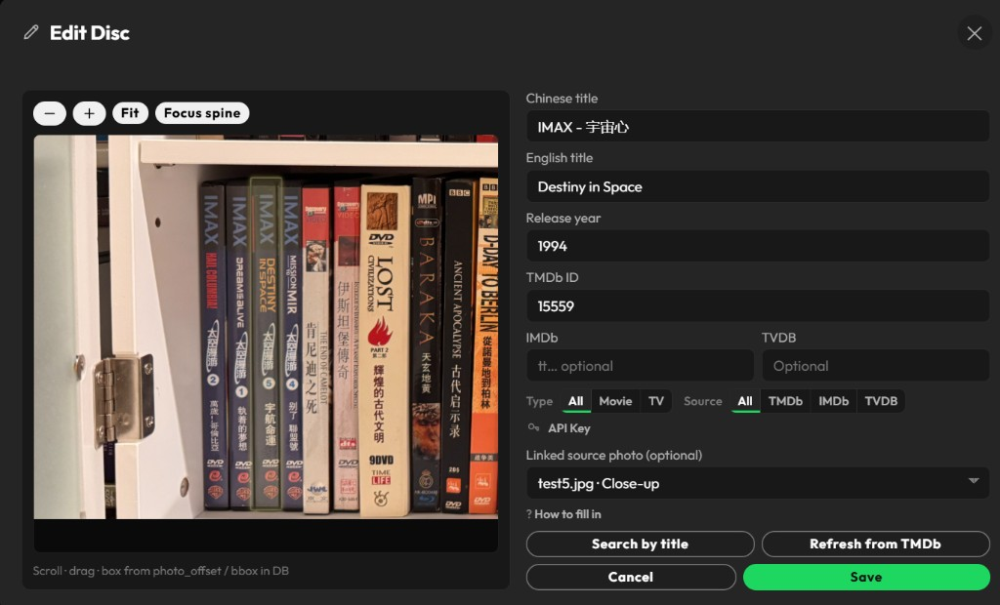
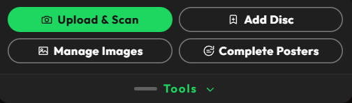
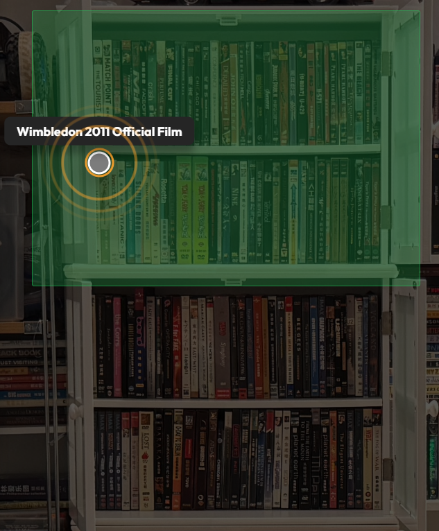

# myWall

A personal Blu-ray/DVD collection wall: photograph a shelf, identify disc spines, match **TMDb / OMDb (IMDb) / TheTVDB** metadata, and browse or edit the catalog in a web browser.

Current application baseline: **v4.1**.

## Branches and documentation language

- **`main`: Chinese stable release.** It preserves the v4.1 Chinese-first interface, manual, and runtime behavior.
- **`i18n`: multilingual experimental release.** It develops English, Simplified Chinese, Japanese, and Korean UI support independently, with English as the default UI and content locale.

The branches follow a dual-track release model and are not merged automatically. See [`docs/i18n-plan.md`](docs/i18n-plan.md) for architecture, compatibility, status, and milestones.

All repository documentation on `i18n` is maintained in English, including this README, `docs/`, project guidance, and both manual entry points. Localized strings in `static/locales/*.json` are runtime UI assets, not project documentation; their non-English translations are intentionally preserved.

## i18n branch status

- UI dictionaries and persisted UI/content locale preferences are available for `en`, `zh`, `ja`, and `ko`.
- The compact sidebar language chips change the UI locale without overwriting the independent content locale.
- Missing UI keys fall back to English and then the key name.
- Missing localized content falls back to English, original-language data, and legacy compatibility fields.
- `static/docs/manual.en.html` is the canonical English manual. `static/docs/manual.html` is an English compatibility entry that forwards to it.

## v4.1 highlights

- **Hot Words filtering:** force-directed attraction and dragging, hard boundaries, resizable panel, minimum font sizes, heat-weighted settling, and a stable centered cluster that does not repack when selecting a word or opening details.
- **Cards:** compact outline action icons without circular backgrounds, stronger whole-card hover visibility, and a brighter hover surface.
- **Wall brightness:** defaults to **50%**, remains adjustable from about 30% to 100%, and is stored locally.
- **Search:** includes director/cast JSON fields such as `name_en` and normalizes spaces, common hyphens, and CJK middle-dot variants.

## Run locally

Python 3.10 or newer is required.

```powershell
git switch i18n
python -m venv .venv
.\.venv\Scripts\activate
pip install -r requirements.txt
python app.py
```

Open [http://127.0.0.1:5000](http://127.0.0.1:5000). The service listens on `0.0.0.0:5000` by default. A phone on the same Tailscale network can use the computer's MagicDNS hostname with port `5000` without exposing a public port.

The complete in-app manual is available at `/static/docs/manual.en.html`; `/static/docs/manual.html` forwards to the same English manual.

Use `git switch main` only for the separate Chinese stable release. Do not run migration tests for both branches against the same actively written database. Copy the ignored database to a separate test file first.

## Configure API keys

All three providers are optional. A provider without a configured key is disabled in search.

- **TMDb:** posters and movie/series metadata. Apply at [themoviedb.org/settings/api](https://www.themoviedb.org/settings/api).
- **OMDb (IMDb):** IMDb title search. Apply at [omdbapi.com/apikey.aspx](https://www.omdbapi.com/apikey.aspx).
- **TheTVDB:** series/movie metadata. See [thetvdb.com/api-information](https://thetvdb.com/api-information).

The recommended method is the **API Key** section in the Edit Disc or Add Disc dialog. Values are stored locally in ignored `data/api_keys.json`, are hot-read, and do not require a restart.

Environment variables are also supported when the JSON settings do not override them; see `.env.example`:

```text
TMDB_API_KEY=
TMDB_ACCESS_TOKEN=
OMDB_API_KEY=
TVDB_API_KEY=
```

Never commit real keys, `.env`, or `data/api_keys.json`. If TMDb requires a proxy, set `HTTPS_PROXY`, `HTTP_PROXY`, or `MYWALL_HTTP_PROXY`.

## Optional local vision model

Automatic spine recognition depends on an **LM Studio OpenAI-compatible** service on the local computer or LAN, not a hosted vision API.

1. Install [LM Studio](https://lmstudio.ai/) and download a vision model. The default ID is `zai-org/glm-4.6v-flash`.
2. Start LM Studio Local Server, commonly on port `1234`.
3. Configure `config.py` or environment variables:
   - `LMSTUDIO_BASE`: endpoint such as `http://127.0.0.1:1234`; use the model host's LAN address if it runs on another computer.
   - `VISION_MODEL`: loaded model ID. With `VISION_MODEL_AUTO=1`, myWall selects from its preference list.
4. Confirm the Flask host can reach the endpoint through local routing and firewall rules.
5. If a system tunnel or global proxy intercepts LAN traffic, bypass the local subnet or proxy only outbound metadata domains.

Without a reachable model, Stage2 and automatic upload analysis are unavailable. The manual workflow below still works.

## Manual wall-building workflow

You can build the collection without a local vision model:

1. Select the lock beside the version to enable editing on desktop.
2. Open **Tools → Upload & Scan** and upload a spine close-up; analysis may be skipped.
3. Open the spine-box editor and adjust boxes manually.
4. Run Stage2 only when a vision model is available.
5. Open **Tools → Add Disc**.
6. Enter at least one title, search TMDb / OMDb / TVDB, and select a trusted candidate to fill artwork and IDs.
7. Place the close-up on the panoramic wall from the detail workflow.
8. Use a phone as a read-only viewer and hold a card to inspect its AR location.

## Screenshots

The screenshots below show the English-first `i18n` interface. They were provided and approved for publication by the collection owner; no credentials or API keys are visible.

<figure>
  
  <figcaption>Desktop overview — browse the filtered collection, explore the genre cloud, and inspect disc details side by side.</figcaption>
</figure>

<figure>
  
  <figcaption>Edit Disc — refine the source-photo spine box while reviewing titles, IDs, metadata source, and artwork settings.</figcaption>
</figure>

<figure>
  
  <figcaption>Tools tray — open the main ingestion, catalog maintenance, image management, and poster completion workflows.</figcaption>
</figure>

<figure>
  
  <figcaption>Language controls — switch among English, Simplified Chinese, Japanese, and Korean UI locales from the sidebar header.</figcaption>
</figure>

<figure>
  
  <figcaption>Wall locate — highlight a title's calibrated physical position with an aligned source-photo overlay and location ring.</figcaption>
</figure>

## Files intentionally excluded from Git

The personal catalog, original wall photos, uploads, recognition output, and credentials are excluded by `.gitignore`:

- `data/api_keys.json`, `.env`
- `data/mywall.db`
- `photos/`, `uploads/`
- `out_b_stage1_*`, `data/spine_results/`, and related recognition output
